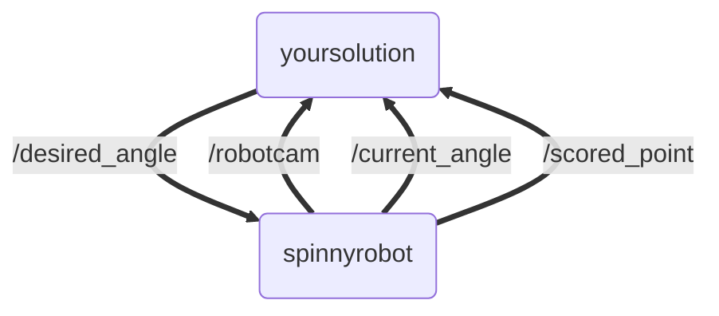

# TR-CV-1
Second Training Module for TR CV Recruits

## Task Overview

In this module you will be given a simulated robot which you will have to control to point at a target.
- You don't have to write a controller, just tell the robot which angle to point.
- The target is always visible from the 0 radians position, and the FOV of the camera is 90 degrees, so the furthest one should rotate is $\frac{\pi}{2}$ radians.
- The robot will score a "point" if it centers the target cube on screen for 2 seconds.
- A point is scored if the average position of the red pixels is within 60 pixels in either direction of the x-coordinate center of the image.
- The robot's position will be homed to the 0 radians position instantly after every successful point scored.

The goal of this assignment is for the robot to score points without user input. However it does this, as long as it uses the provided topics, is allowed.

https://github.com/Triton-Robotics-Training/TR-CV-2/assets/33632547/2f87f417-0c14-410c-9a57-3aefcbd1d4ca

## Getting Started

You will need to have numpy, opencv, and pybullet installed on your machine.

The main node can be run with (at the root):
```bash
colcon build
source install/setup.bash
ros2 run spinnyrobot spinnyrobot
```

## Architecture

The following topics are available:

```bash
$ ros2 topic list
/current_angle
/desired_angle
/parameter_events
/robotcam
/rosout
/scored_point
```

The spinnyrobot node publishes to /current_angle, /robotcam, and /scored_point

The /current_angle is of type std_msgs/msg/Float32:
```bash
$ ros2 topic info /current_angle
Type: std_msgs/msg/Float32
Publisher count: 1
Subscription count: 0
```

There is also /scored_point which is of type std_msgs/msg/Empty and is transmitted every time the robot scores a point, and /robotcam which is an /sensor_msgs/msg/Image using bgr8 encoding. If you want to look at it, you can run:

```
ros2 run rqt_image_view rqt_image_view /robotcam
```

Your task is to publish a Float32 to /desired_angle, somehow making the robot point at the target and scoring a point.

An outline of how to get the image into ROS2 C++ for processing with opencv is here:
https://www.theconstructsim.com/how-to-integrate-opencv-with-a-ros2-c-node/

This is what the result should look like:


